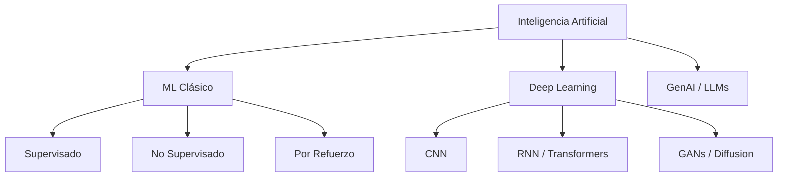

La inteligencia artificial no es magia. Es ingeniería estadística a escala — encontrar patrones en datos usando modelos matemáticos optimizados por gradientes. Este post cubre los fundamentos técnicos que todo desarrollador debería entender para trabajar con IA de forma efectiva.

## El mapa del ML — no todo es deep learning



| Paradigma | Datos necesarios | Ejemplo típico | Precisión típica |
|-----------|-----------------|----------------|-----------------|
| ML Clásico | Cientos a miles | Clasificación, regresión, clustering | 80-95% |
| Deep Learning | Miles a millones | Visión, NLP, secuencias | 90-99% |
| LLMs | Miles de millones de tokens | Texto generativo, código, QA | Variable |

ML clásico gana cuando tienes pocos datos estructurados y necesitas interpretabilidad. Deep Learning gana cuando tienes muchos datos no estructurados y necesitas precisión.

## ML supervisado — el motor del aprendizaje

### Regresión lineal

```python
import numpy as np
from sklearn.linear_model import LinearRegression

X = np.array([[1], [2], [3], [4], [5]])
y = np.array([2.1, 3.9, 6.2, 7.8, 10.1])

model = LinearRegression()
model.fit(X, y)

y_pred = model.predict(np.array([[6]]))
print(f"Coeficiente: {model.coef_[0]:.2f}")  # pendiente
print(f"Intercepto: {model.intercept_:.2f}")  # sesgo
```

La regresión lineal encuentra la línea que minimiza el error cuadrático medio (MSE). Simple, interpretable, pero falla con relaciones no lineales.

### Árboles de decisión y Random Forest

```python
from sklearn.ensemble import RandomForestClassifier
from sklearn.model_selection import train_test_split
from sklearn.metrics import classification_report

X_train, X_test, y_train, y_test = train_test_split(features, labels, test_size=0.2)

rf = RandomForestClassifier(
    n_estimators=100,    # número de árboles
    max_depth=10,        # profundidad máxima
    min_samples_leaf=5,  # mínimo de muestras por hoja
    random_state=42
)
rf.fit(X_train, y_train)

y_pred = rf.predict(X_test)
print(classification_report(y_test, y_pred))

# Importancia de features (qué columnas más influyen)
print(dict(zip(feature_names, rf.feature_importances_)))
```

Random Forest es el "modelo base" por defecto para datos tabulares. Funciona bien sin escalar features, maneja valores nulos, y es robusto al overfitting.

## Deep Learning — redes neuronales

### El perceptrón multicapa

```python
import torch
import torch.nn as nn
import torch.optim as optim

class Classifier(nn.Module):
    def __init__(self, input_dim, hidden_dim, output_dim):
        super().__init__()
        self.net = nn.Sequential(
            nn.Linear(input_dim, hidden_dim),
            nn.ReLU(),
            nn.Dropout(0.3),         # regularización
            nn.Linear(hidden_dim, hidden_dim),
            nn.ReLU(),
            nn.Dropout(0.3),
            nn.Linear(hidden_dim, output_dim),
            nn.Softmax(dim=1)
        )

    def forward(self, x):
        return self.net(x)

model = Classifier(input_dim=784, hidden_dim=256, output_dim=10)
criterion = nn.CrossEntropyLoss()
optimizer = optim.Adam(model.parameters(), lr=0.001, weight_decay=1e-5)
```

Componentes clave:
- **Función de activación**: ReLU (evita saturación de gradientes), sigmoid/tanh (no se usan en capas ocultas hoy).
- **Dropout**: apaga neuronas aleatoriamente durante entrenamiento para prevenir overfitting.
- **Adam**: optimizador adaptativo — ajusta learning rate por parámetro.

### El pipeline completo de entrenamiento

```python
def train_epoch(model, dataloader, optimizer, criterion):
    model.train()
    total_loss = 0
    for batch_x, batch_y in dataloader:
        optimizer.zero_grad()
        output = model(batch_x)
        loss = criterion(output, batch_y)
        loss.backward()      # retropropagación
        nn.utils.clip_grad_norm_(model.parameters(), 1.0)  # evitar exploding gradients
        optimizer.step()
        total_loss += loss.item()
    return total_loss / len(dataloader)

for epoch in range(100):
    train_loss = train_epoch(model, dataloader, optimizer, criterion)
    if epoch % 10 == 0:
        print(f"Epoch {epoch}: loss={train_loss:.4f}")
```

La retropropagación calcula el gradiente del error respecto a cada peso mediante la regla de la cadena. El optimizador actualiza los pesos en dirección contraria al gradiente. Repetir hasta convergencia.

## NLP — Transformers y atención

La arquitectura Transformer (2017) reemplazó a RNNs/LSTMs porque permite paralelización completa en entrenamiento:

```python
# Self-attention en una línea
# attn(Q, K, V) = softmax(QK^T / sqrt(d_k)) * V
import torch.nn.functional as F

def scaled_dot_product_attention(Q, K, V):
    scores = torch.matmul(Q, K.transpose(-2, -1)) / (Q.size(-1) ** 0.5)
    attn_weights = F.softmax(scores, dim=-1)
    return torch.matmul(attn_weights, V)
```

La atención mide qué tan relacionada está cada palabra con todas las demás. El `softmax` normaliza los scores, y la división por `sqrt(d_k)` evita gradients pequeños cuando la dimensionalidad es alta.

### LLMs — cómo funcionan

Los modelos de lenguaje grandes (GPT, Claude, Llama) son transformadores con cientos de miles de millones de parámetros entrenados en tokens (palabras/subpalabras). El entrenamiento tiene dos fases:

1. **Pre-training**: predecir la siguiente palabra (autoregresivo). Sin supervisión — solo necesitas texto.
2. **Fine-tuning / RLHF**: alinear el modelo con preferencias humanas.

```python
# Uso de un LLM local (Ollama, llama.cpp)
from openai import OpenAI
client = OpenAI(base_url="http://localhost:11434/v1")

response = client.chat.completions.create(
    model="llama3:8b",
    messages=[
        {"role": "system", "content": "Eres un asistente técnico."},
        {"role": "user", "content": "Explica qué es un transformer en 3 líneas."}
    ],
    temperature=0.3,   # más bajo = más determinista
    max_tokens=200
)
print(response.choices[0].message.content)
```

Técnicas avanzadas:
- **RAG** (Retrieval-Augmented Generation): busca en una base de conocimiento antes de responder. Mejor que fine-tuning para datos que cambian.
- **Fine-tuning LoRA**: adaptadores de bajo rango — entrena solo ~1% de los parámetros. Rápido, barato.
- **Prompt engineering**: el arte de estructurar la entrada para obtener la salida deseada. Chain-of-thought, few-shot, system prompts.

## IA ética — bias, fairness, transparencia

```python
# Detección de sesgo en un modelo de clasificación
from sklearn.metrics import confusion_matrix

def demographic_parity(y_pred, sensitive_attr):
    """La tasa de predicción positiva debería ser similar entre grupos"""
    for group in sensitive_attr.unique():
        mask = sensitive_attr == group
        rate = y_pred[mask].mean()
        print(f"{group}: tasa positiva = {rate:.2%}")

def equal_opportunity(y_true, y_pred, sensitive_attr):
    """La tasa de verdaderos positivos debería ser similar"""
    for group in sensitive_attr.unique():
        mask = (sensitive_attr == group) & (y_true == 1)
        if mask.sum() > 0:
            tpr = (y_pred[mask] == 1).mean()
            print(f"{group}: TPR = {tpr:.2%}")
```

Un modelo puede tener alta precisión general pero fallar sistemáticamente en ciertos grupos demográficos (sesgo racial, de género, socioeconómico). Medir estas métricas no es opcional si el modelo impacta personas.

## Stack técnico 2026

| Capa | Opciones populares |
|------|-------------------|
| Frameworks | PyTorch 3.x, JAX, Transformers |
| Entrenamiento | Modal, RunPod, Lambda, Trainium |
| Inferencia | vLLM, TensorRT, llama.cpp, ONNX |
| Orquestación | LangChain, LlamaIndex, Haystack |
| Embeddings | text-embedding-3-large, BGE, E5 |
| Vector DBs | pgvector, Qdrant, Chroma, Milvus |
| Monitoreo | LangFuse, Weights & Biases, Arize |

La IA está transformando el desarrollo de software no como una moda, sino como una nueva primitiva computacional. Entender sus fundamentos —gradientes, transformers, embeddings— te permite usarla con criterio, no solo pegar APIs.
